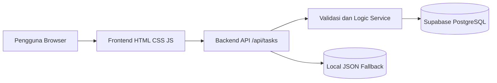

# Cloud Task Manager

Aplikasi manajemen tugas/proyek berbasis cloud untuk memenuhi UAS mata kuliah Arsitektur Perangkat Lunak dan Data Berbasis Cloud.

## Fitur

- CRUD tugas: tambah, lihat, edit, hapus.
- Validasi judul, status, prioritas, dan tanggal.
- Frontend web responsif.
- Backend/API `/api/tasks`.
- Database cloud memakai Supabase REST API.
- Fallback penyimpanan lokal `data/tasks.json` untuk demo tanpa akun cloud.

## Arsitektur



## Menjalankan Lokal

```bash
npm start
```

Buka `http://localhost:3000`.

## Konfigurasi Supabase

1. Buat project di Supabase.
2. Jalankan SQL pada `docs/schema.sql`.
3. Salin `.env.example` menjadi `.env`.
4. Isi `SUPABASE_URL` dan `SUPABASE_SERVICE_ROLE_KEY`.
5. Jalankan ulang aplikasi.

## Deployment Vercel

1. Push folder proyek ke repository GitHub.
2. Import repository ke Vercel.
3. Tambahkan environment variable:
   - `SUPABASE_URL`
   - `SUPABASE_SERVICE_ROLE_KEY`
4. Deploy.
5. Uji URL aplikasi dan endpoint `/api/tasks`.

## Pengujian

```bash
npm test
```

Test menjalankan server lokal sementara dan memeriksa read, create, update, delete, serta validasi input.
